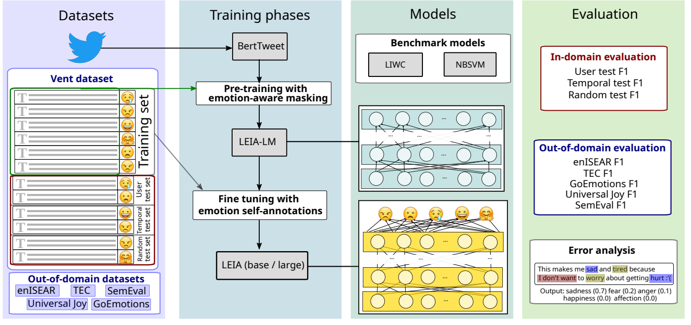
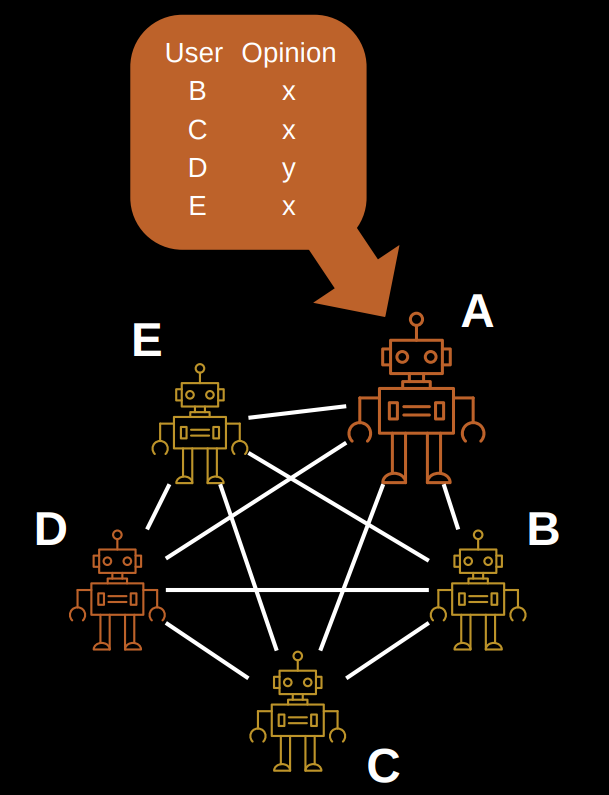

```{r xaringan-themer, include=FALSE, warning=FALSE}
#This block contains the theme configuration for the CSS lab slides style
library(xaringanthemer)
library(showtext)
style_mono_accent(
  base_color = "#5c5c5c",
  text_font_size = "1.5rem",
  header_font_google = google_font("Arial"),
  text_font_google   = google_font("Arial", "300", "300i"),
  code_font_google   = google_font("Fira Mono")
)
```

```{r setup, include=FALSE}
options(htmltools.dir.version = FALSE)
```


layout: true
<div class="my-footer"><span>David Garcia - Computational Social Science: From Digital Traces to Generative Agents</span></div> 

---

background-image: url(figures/AboutUS.svg)
background-size: 98%

---
# Research and Education

---

# Outline

## 1. A View of Computational Social Science

## 2. Studying Emotions from Digital Traces 

## 3. Generative CSS: Collective Behavior in LLMs

---

## *Computational* in Computational Social Science
It can have three meanings:

- **Digital**<br> 
Based on large datasets of human behavior, for example produced by the Web and social media

- **Computerized**<br>
The quantitative analysis of data in an automated, tractable, repeatable, and extensible fashion

- **Generative**<br>
Application of data and results to design of agent-based models that explain complex social phenomena and motivate interventions

---

## The Hype Cycle of Computational Social Science
<center>
```{r, echo=FALSE, out.width=900}
knitr::include_graphics("figures/Hype1.svg")
```

---

# Avoiding data piñatas

```{r, echo=FALSE, out.width=1050}
knitr::include_graphics("figures/pinata.png")
```

---

## The Hype Cycle of Computational Social Science
<center>
```{r, echo=FALSE, out.width=900}
knitr::include_graphics("figures/Hype3.svg")
```

---
background-image: url(figures/VennV3-pre.svg)
background-size: 97%
---
background-image: url(figures/VennV3.svg)
background-size: 97%
---

# Studying Emotions from Digital Traces 

## 1. A View of Computational Social Science

## *2. Studying Emotions from Digital Traces*

## 3. Generative CSS: Collective Behavior in LLMs

---

layout: true
<div class="my-footer"><span><a href="https://epjdatascience.springeropen.com/articles/10.1140/epjds/s13688-023-00427-0"> LEIA: Linguistic Embeddings for the Identification of Affect. Segun Taofeek Aroyehun, Lukas Malik, Hannah Metzler, Nikolas Haimerl, Anna Di Natale, David Garcia. EPJ Data Science (2023)</a></span></div> 

---
background-image: url(figures/CollectiveEmotionsParis.svg)
background-size: 98%
---

## State-of-the-practice Sentiment Analysis Pipeline

.left-column[

]

.right-column[
1. Create representative sample of documents from application case
2. Crowdsource annotations (e.g. Mechanical Turk, FigureEight, students...)
3. Split development/training/test samples from annotated documents
4. Develop model using the development sample, evaluate on training sample with cross-validation
5. Train final model on full train sample
6. One evaluation run over test sample. Report performance versus a benchmark including other models and methods
7. Apply model over rest of documents
]
---

# Challenges in Emotion Identification

```{r, echo=FALSE, out.width=950, fig.align='center'}
knitr::include_graphics("figures/communication.png")
```

Current sentiment analysis approaches assume that the **ground truth** is an annotation of emotions by **a reader**, often a student or a crowdsourcing worker

Noise in ground truth creates **unmeasured error** and potential biases

---

## Vent: Self-annotated Social Media Emotions


<div style="font-size:18pt"><span>Lykousas, N., Patsakis, C., Kaltenbrunner, A., & Gómez. Sharing emotions at scale: The vent dataset. ICWSM (2019)</span></div> 

---

### LEIA: Linguistic Embeddings for the Identification of Affect



---

# Vent Datasets Summary

</br>

| Label        | Train            | Development    | User Test      | Time Test  | Random Test    |
|--------------|:------------------:|:----------------:|:----------------:|:----------------:|:----------------:|
| Sadness      | 1,712,985  | 199,890  | 262,999  | 293,993  | 264,906  |
| Anger        | 1,517,282 | 147,778  | 224,997  | 205,598  | 226,068  |
| Fear         | 1,341,624  | 138,929  | 198,264  | 185,461  | 201,563  |
| Affection    | 979,019    | 144,175  | 161,018  | 191,022| 158,017  |
| Happiness    | 795,363    | 74,369   | 118,290  | 91,127    | 116,647  |
| **Total** | **6,346,273**        | **705,141**        | **965,568**        | **967,201**        |** 967,201 **       |

---

# Out-Of-Domain Datasets

- We gathered datasets of emotion annotations from previous research
- We use only test samples to allow future benchmarks
- enISEAR and UniversalJoy are reader-annotated. TEC similarly with \#-tags
- Affection not present in OOD datasets
- Not a hard test of generalizability but a way to explore other domains

| Dataset       | Source |  Year  | Sadness | Anger | Fear | Happiness | Total |
|---------------|---------|---------|:---------:|:-------:|:------:|:-----------:|:--------------:|
| **enISEAR**       | Writing tasks | 2019   | 143     | 143   | 143  | 143       | 572          |
| **TEC**           | Twitter #emo  | 2012   | 765     | 305   | 499  | 1,627     | 3,196        |
| GoEmotions    | Reddit | 2020   | 259     | 520   | 77   | 1,598     | 2,454        |
| **Universal Joy** | Facebook   | 2021 | 128     | 58    | 11   | 384       | 581          |
| SemEval       | Twitter | 2018    | 312     | 511   | 165  | 706       | 1,694        |

---

# Results in Vent

<center>  </center>

LEIA outperforms supervised and unsupervised methods for all emotions and test datsets. $F_1$ values between 70 and 80.

---

# Out-of-domain results

|               | LIWC               | NRC                | NBSVM              | LEIA-base          | LEIA-large         |
|---------------|:--------------------:|:--------------------:|:--------------------:|:--------------------:|:--------------------:|
| Universal Joy | 23.45 | 28.98 | 41.70 | **54.18** | 54.17 |
| GoEmotions    | 45.81 | 32.68 | 48.23 | **46.31** | 45.75 |
| TEC           | 36.02 | 33.92 | 39.07 | 43.87 | **44.12** |
| SemEval       | 66.72  | 49.86  | 68.77 | **71.68** | 70.04 |
| enISEAR       | 23.51 | 42.72 | 55.33 | 70.37 | **79.94** |


- LEIA is best or tied with the best in all out-of-domain tests
- LEIA is best or tied with the best in all emotions except Fear in TEC
- Note: very different media, sampling methods, and labelling schemes

---

# Comparing with GPT models
|           | LEIA-base          | LEIA-large         | GPT-3.5            | GPT-4              |
|-----------|--------------------|--------------------|--------------------|--------------------|
| Affection | 74.48 | **75.67** | 41.38 | 37.43 |
| Anger     | 72.92 | **72.98** | 61.79 | 66.82 |
| Fear      | 69.01 | **70.26** | 51.55 | 60.86 |
| Happiness | **77.69** | 77.58 | 67.69 | 68.70 |
| Sadness   | 67.28 | **68.00** | 59.94  | 64.00 |
| Average   | 72.28 | **72.90** | 56.47 | 59.56 |


- Evaluation on a sample of 1000 texts per emotion label from the user test sample. GPT models used with a standard prompt for zero-shot classification
- LEIA greatly outperforms GPT-3.5-turbo and GPT-4 in each emotion

---

# Comparing with GPT models (OOD)

|               | LEIA-base          | LEIA-large         | GPT-3.5            | GPT-4              |
|---------------|--------------------|--------------------|--------------------|--------------------|
| Universal Joy | 54.18 | 54.17 | 52.89  | **56.43**  |
| GoEmotions   |   46.31    |  45.75      |   **59.06**    |   56.45          |
| TEC           | 43.87 | 44.12 | 52.66  | **54.82** |
| SemEval       | 71.68 | 70.04 | 80.13  | **81.72** |
| enISEAR       | 70.37 | 79.94 | 84.96 | **89.97** |

- GPT models outperform LEIA in GoEmotions, TEC, SemEval, and enISEAR
- LEIA en par with GPT for Universal Joy
- Model contamination? test samples for all these datasets are public and GPT models could have been trained with them
- Universal Joy might be younger than the cutoff date

---

# LEIA (versus) Humans

.center[]
- Students annotating a balanced Vent sample (N=100, 720 annotations)
- Initial results suggest that LEIA is comparable to humans
- **Artificial Affective Intelligence:** Can LEIA help humans read emotions?

---

layout: true
<div class="my-footer"><span><a href="https://arxiv.org/abs/2409.02822"> Language Understanding as a Constraint on Consensus Size in LLM Societies. G de Marzo, C. Castellano, D. Garcia. Arxiv preprint (2024)</a></span></div> 

---

# CSS with Generative Agents

## 1. A View of Computational Social Science

## 2. Studying Emotions from Digital Traces 

## *3. Generative CSS: Collective Behavior in LLMs*

---
# Social Simulacra and Simulation
.center[]
[Generative Agents: Interactive Simulacra of Human Behavior. S. Park et al.](https://arxiv.org/pdf/2304.03442)
---

# LLMs within society

.center[]
- AI "chiefs of staff" promise to interact with each other in our behalf
- Coordination and competition (reservations, negotiations, applications)
- Could norms emerge, for example rules to be more efficient? 
- Could they have risk of alignment, like flash crashes?

---
# LLMs as social brains
.center[]
---

# Opinion dynamics simulation with LLM
.pull-left[.center[]]
.pull-right[
- Simulation of a tight group of N interacting agents
- Agents start with a random opinion of two options
- Each iteration, they see the opinions of all others (prompt)
- They respond to the question of their opinion
- Opinion labels need to be random and shuffled to avoid token biases
- Consensus is achieved if all have the same opinion
]

---

# LLM-dependent consensus formation
.center[]
Opinion dynamics can be modeled as an S-function parametrized by a majority force $\beta$. Consensus is possible for $\beta>1$
---

# Majority force factors
.center[]
- Majority force is higher for models with higher language understanding capabilities (MMLU benchmark)
- Majority force decreases for larger group sizes

---

# Group size and language understanding
.pull-right[]

- Analysis of majority force and exhaustive simulations to measure **critical consensus size**

- Exponential function of MMLU benchmark

- Humans close to the line

- GPT4 and Claude3 opus reach consensus for $N=1000$
  - LLM emergent consensus scale beyond humans


---

# Summary

- My key to CSS: Questions first, then data
- Methods for measurement and modelling the future of CSS
- LEIA to have Affect Identification with valid training data
- LLM consensus scale predicted by language understanding capabilities
- LLMs can reach emergent consensus at scales beyond humans
- Future: Social Simulation with LLMs 

<a href="https://epjdatascience.springeropen.com/articles/10.1140/epjds/s13688-023-00427-0"> LEIA: Linguistic Embeddings for the Identification of Affect. S. Aroyehun, L. Malik, H. Metzler, N. Haimerl, A. Di Natale, D. Garcia. EPJ Data Science (2023)</a><br>
Try it yourself: https://huggingface.co/LEIA/LEIA-base

<a href="https://arxiv.org/abs/2409.02822"> Language Understanding as a Constraint on Consensus Size in LLM Societies. G de Marzo, C. Castellano, D. Garcia. Arxiv preprint (2024)</a>

.center[**More at: [www.dgarcia.eu](https://dgarcia.eu)**]

